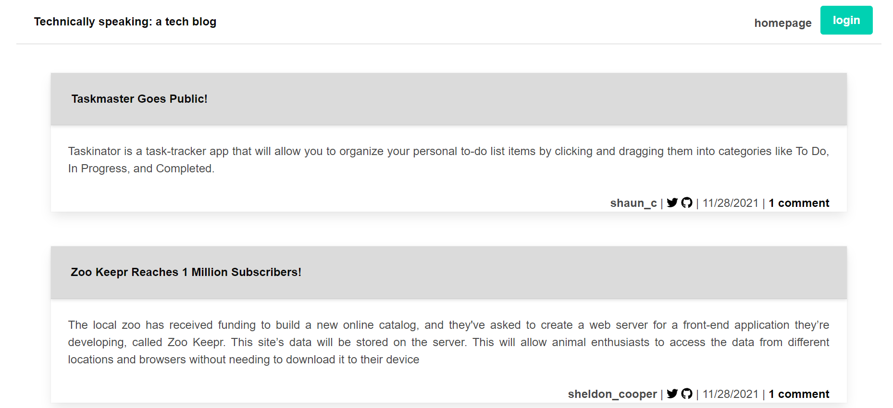
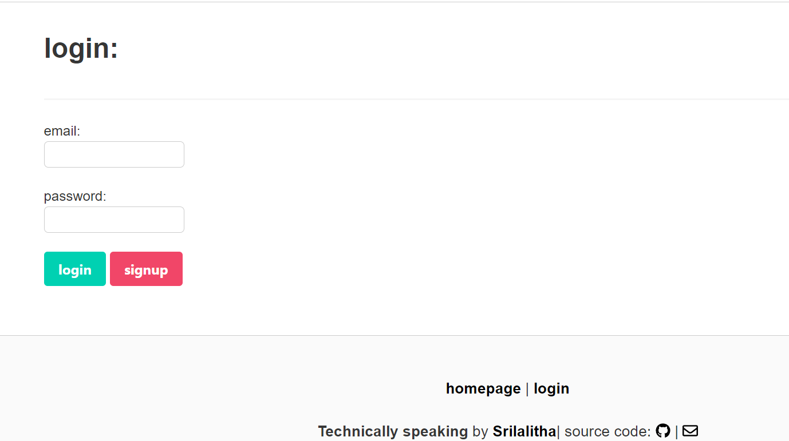
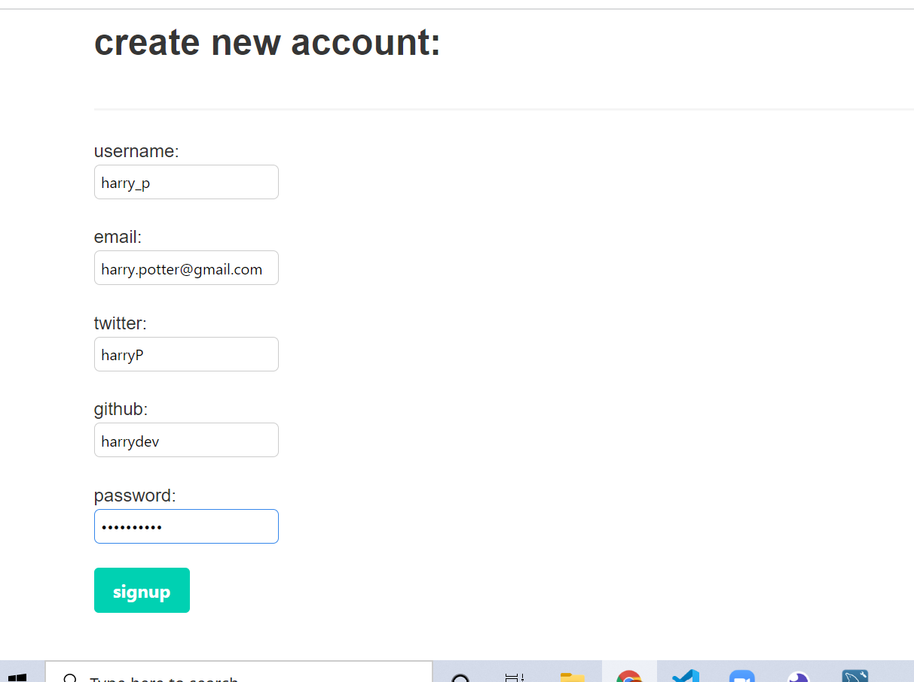
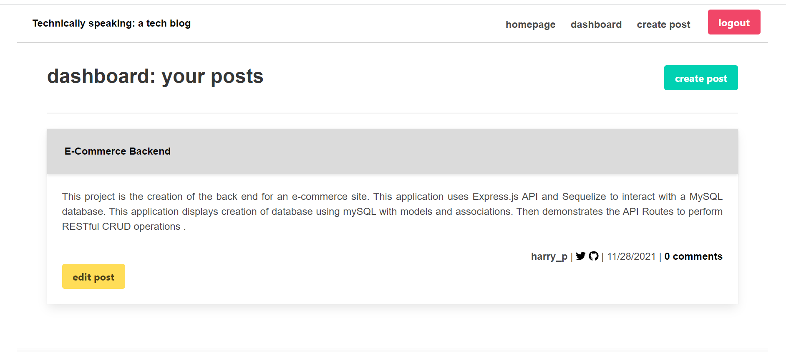
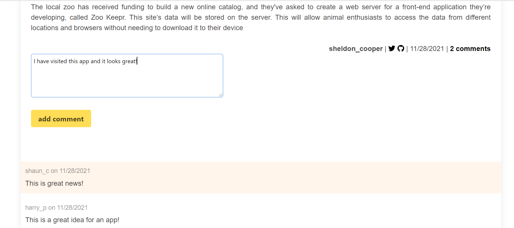

# TECH-BLOG - Model View Controller (MVC)

## Description

- This project uses the Model-View-Controller (MVC) paradigm to create a blog-style website where developers can create an account, edit their information, make posts, edit posts, and comment on other user's posts.
- The app follows the MVC paradigm in its architectural structure, using Handlebars.js as the templating language, Sequelize as the ORM, and the express-session npm package for authentication.

## Table of Contents

- [Description](#Description)
- [Installation](#Installation)
- [Usage](#Usage)
- [Contributing](#Contributing)
- [Assets](#Assets)

## Installation

You will need Node.js installed on your local machine

- Clone the repository to your local development environment.

* git clone https://github.com/SrilalithaN/Tech-Blog

* The dependencies that are used in this application are "bcrypt", "connect-session-sequelize", "dotenv", "express", "express-handlebars", "express-session","mysql2", "sequelize". If these packages are not present within your Node modules folder then run the command “npm install package-name” to install the missing packages.

* To connect to the database run `mysql -u root -p` and also enter username and password in .env file.

* Then run `source db/schema.sql` in command line.

* To seed the file run `npm run seed` or `node seeds/index.js`.

* Finally to connect to server run `node server.js` or `npm run start`.

# Usage

- Visit the website on Heroku. You can view posts and visit links as a visitor, create your own account, and as an authenticated user you can add your own posts and comment on other posts as well. You can edit titles and content or delete your own posts as well. You can also update your username, email, and password.

Warning: New data is stored on Heroku for an indeterminate period of time. At least once a day the dynos will be restarted and any new data included new users might be wiped out.

# Assets

- The following are the screenshots of the application:
- Homepage 
- Login 
- Signup 
- Create-post 
- Add comment 

- The following is the link to application deployed on heroku: https://tech-blog-sri.herokuapp.com/
- The following is the link to the deployed code on github : https://github.com/SrilalithaN/Tech-Blog
